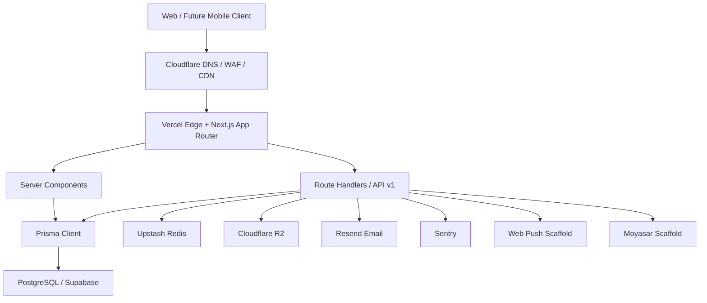

# جود العقارية — Architecture

## Principles

- **Arabic-first, Egyptian-first:** Arabic default locale, RTL layout, EGP currency, Egyptian regions and cities seeded from day one.
- **Server Components first:** Data-heavy pages render on the server; client components are reserved for forms, filters, toggles, and rich interactions.
- **API-first:** Public and mobile-ready contracts are versioned under `/api/v1`.
- **Operational by design:** Health checks, cron routes, audit logs, cache invalidation, and backup workflows are part of the app, not launch afterthoughts.
- **Provider isolation:** Email, storage, cache, analytics, feature flags, and payments are behind local modules so providers can be replaced.

## System Diagram



## Stack

| Layer              | Technology                                                 |
| ------------------ | ---------------------------------------------------------- |
| Framework          | Next.js 14 App Router                                      |
| Language           | TypeScript strict mode                                     |
| Styling            | Tailwind CSS + in-repo UI primitives                       |
| i18n               | next-intl with `/ar` and `/en`                             |
| Auth               | Auth.js / NextAuth v5 credentials + encrypted JWT sessions |
| Database           | PostgreSQL via Prisma                                      |
| Cache / Rate Limit | Upstash Redis                                              |
| Storage            | Cloudflare R2                                              |
| Email              | Resend                                                     |
| Monitoring         | Sentry + health endpoint                                   |
| API Docs           | OpenAPI 3.0 + Swagger UI                                   |

## Folder Structure

```text
app/
  [locale]/                 localized public, dashboard, and admin pages
  api/                      web APIs, admin APIs, v1 APIs, docs, health, cron
components/
  admin/                    admin surfaces and data tools
  layout/                   global layout navigation
  property/                 listing cards, forms, galleries, specs
  search/                   filtering, sorting, saved search UI
  shared/                   uploaders, pagination, docs viewer
lib/
  auth*.ts                  Auth.js web and v1 helpers
  prisma.ts                 Prisma singleton
  redis.ts                  cache helper
  feature-flags.ts          DB-backed flags with Redis cache
  public-properties.ts      cacheable public listing queries
  cache-bust.ts             cache versioning and revalidation
prisma/
  schema.prisma             database schema
  migrations/               migration history
  seed.ts                   idempotent baseline data
infrastructure/
  docker/                   local Postgres/Redis
  scripts/                  backup script
```

## Data Model Highlights

- `users`, `user_profiles`, `user_sessions`, and `verification_tokens` back identity and account state.
- `properties` is the core listing aggregate with status workflow, geographic joins, classification joins, counters, and search vector.
- `property_images` stores R2 object keys and CDN URLs.
- `favorites`, `saved_searches`, and `inquiries` support retention workflows.
- `audit_logs` captures sensitive admin and system events.
- `feature_flags` controls future capabilities.
- `push_subscriptions` stores future web/mobile notification endpoints.

## API Strategy

- Existing `/api/*` routes serve the web app.
- `/api/v1/*` routes are stable mobile-ready contracts.
- `/api/docs` renders Swagger UI.
- `/api/docs/openapi.json` serves the OpenAPI 3.0 spec.
- v1 auth supports web cookies and `Authorization: Bearer <authjs-session-token>`.

## Security Model

- Role-based access uses `USER`, `AGENT`, `ADMIN`, and `SUPER_ADMIN`.
- Admin routes are guarded by middleware and server-side `requireRole`.
- SUPER_ADMIN-only surfaces include role changes and feature flag control.
- Public write paths are rate limited and validated with Zod.
- Security headers are defined in `next.config.mjs`.
- Sentry event scrubbing removes cookies, auth headers, request bodies, emails, IPs, and phone fields.

## Caching Strategy

- Redis caches public hot paths with short TTLs.
- Cache version keys avoid broad Redis key scans.
- Property moderation and image changes call `bustPropertyCache`.
- Feature flags are cached for five minutes and invalidated on admin mutation.
- ISR is used for public listing/detail pages where safe.

## Future Expansion

- **AI search:** Add pgvector embeddings and replace scaffolded `/api/v1/search/semantic`.
- **Recommendations:** Replace category/city similarity with event-driven ranking once analytics volume exists.
- **Payments:** Complete the Moyasar scaffold for office subscriptions.
- **Multi-tenancy:** Add offices and office membership around the existing `AGENT` role.
- **Mobile apps:** Reuse `/api/v1` with Bearer auth and CDN image URLs.
